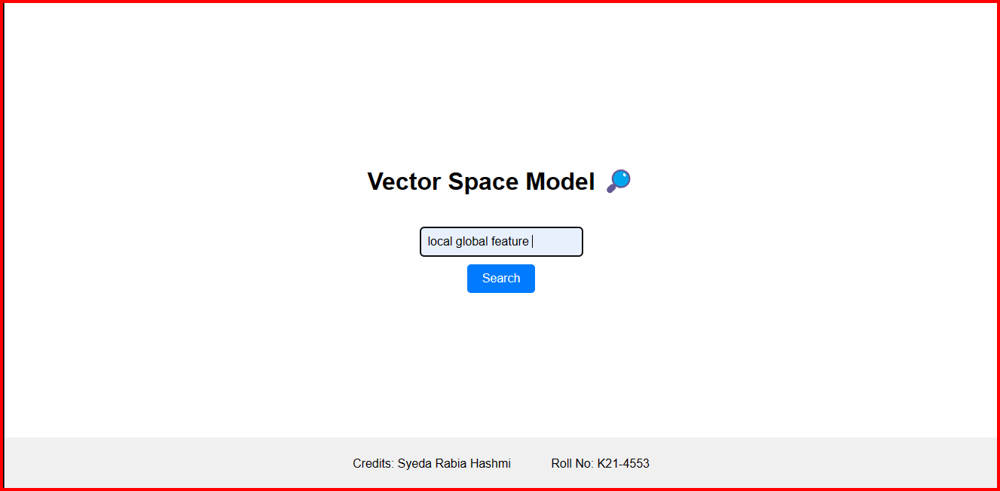
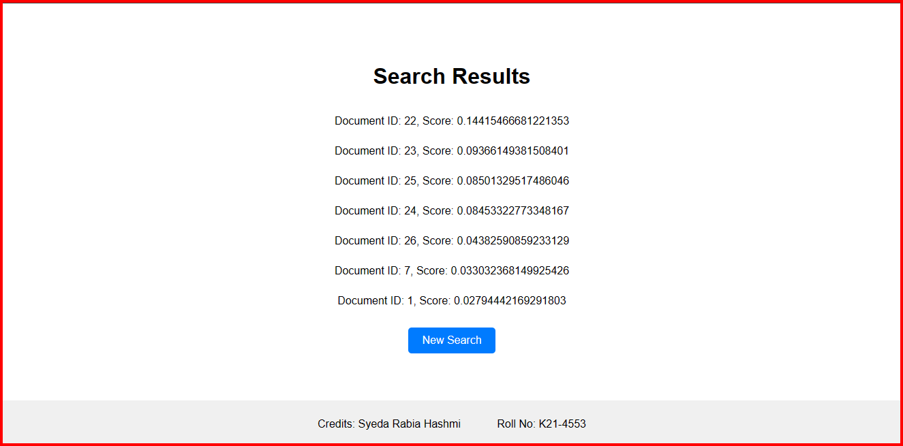

# Vector Space Model (VSM) For Information Retrieval

_K214553 Syeda Rabia Hashmi_

## Introduction:
This project implements a basic Information Retrieval System using the Vector Space Model (VSM). It allows users to search for documents within a corpus based on a query. The system preprocesses the documents, calculates TF-IDF values, and ranks documents based on cosine similarity.

## Features:
- Tokenization: Tokenizes the documents, removing punctuation, numbers, and stop words. It also performs stemming using the Porter Stemmer algorithm.
- Inverted Index: Builds an inverted index containing terms and their occurrences in documents. I have used indexes built during previous project [Boolean Retrieval IR Model.](https://github.com/SRAABIA/Boolean-Retrieval-Model)
- TF-IDF Calculation: Calculates TF-IDF values for each term-document pair.
- Cosine Similarity: Computes and normalizes the cosine similarity between the query and documents to rank them.
- Web Interface: Provides a simple web interface for users to enter search queries and view results.

## Usage:
1. Ensure you have Python installed on your system.
2. Install the necessary dependencies using `pip install (dependancy)`.
3. Place your documents in the `ResearchPapers` directory.
4. Run the `Vector_Space_Model.py` file to start the Flask web server.
5. Access the search interface in your web browser at `http://localhost:5000`.
6. Enter your query in the search bar and press Enter or click the Search button.
7. View the search results on the results page.

## File Structure:
- `Vector_Space_Model.py`: Main Flask application file that handles routing and search functionality.
- `inverted_indexA2.txt`: Text file containing the inverted index data.
- `TF-IDF.txt`: Text file containing TF-IDF values for documents.
- `Stopword-List.txt`: List of stop-words.
- `ResearchPapers/`: Directory containing the corpus of documents.
- `templates/`: Directory containing HTML templates for the web interface.

## Requirements:
- Python 3.x
- Flask
- NLTK (Natural Language Toolkit)

## Credits:
This project was created by Syeda Rabia Hashmi, roll no: K214553, NUCES FAST, Karachi. It is provided as an educational tool for learning about Information Retrieval and Vector Space Model.

## Output:

 

